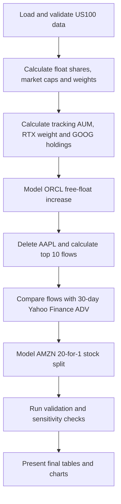

```mermaid
flowchart TD
    A["Load and validate US100 data"] --> B["Calculate float shares, market caps and weights"]
    B --> C["Calculate tracking AUM, RTX weight and GOOG holdings"]
    C --> D["Model ORCL free-float increase"]
    D --> E["Delete AAPL and calculate top 10 flows"]
    E --> F["Compare flows with 30-day Yahoo Finance ADV"]
    F --> G["Model AMZN 20-for-1 stock split"]
    G --> H["Run validation and sensitivity checks"]
    H --> I["Present final tables and charts"]
```
